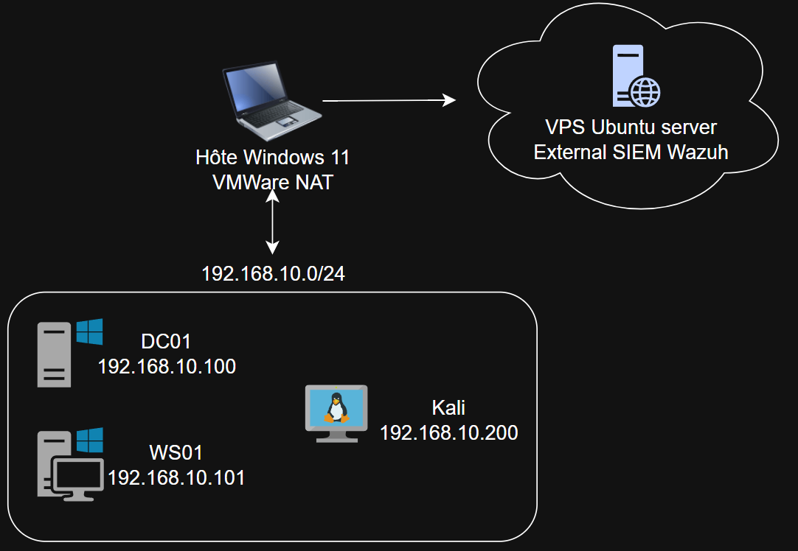

## Schéma Réseau

---
## Table d'adressage IP

| Machine | Rôle                   | IP              | OS                  |
| ------- | ---------------------- | --------------- | ------------------- |
| [DC01](MACHINES/DC01.md)    | Active Directory / DNS | 192.168.10.100  | Windows Server 2022 |
| [WS01](MACHINES/WS01.md)    | Client domaine         | 192.168.10.101  | Windows 10 Pro      |
| [Kali](MACHINES/Kali.md)    | Attaquant              | 192.168.10.200  | Kali Linux 2026.2   |
| [Wazuh](MACHINES/VPS_(Wazuh).md)   | SIEM                   | IP publique VPS | Ubuntu 22.04        |

> Kali est sur le même réseau que l'AD pour simplifier l'infra. En conditions réelles, l'attaquant serait sur un réseau externe avec une IP publique.

---
## Domaine AD

| Élément       | Valeur            |
| ------------- | ----------------- |
| Domaine AD    | `lab.local`       |
| Subnet        | `192.168.10.0/24` |
| DNS principal | `192.168.10.100`  |
| DC principal  | `DC01`            |
| Réseau VMware | `Host-Only`       |

