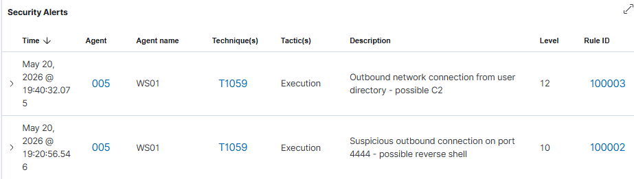

## Détection
### Prérequis

| Composant | Rôle |
|-----------|------|
| Sysmon (SwiftOnSecurity) | Capture Event ID 3 - Network Connection |
| Wazuh agent | Ingestion des logs Sysmon via ossec.conf |
| Règles custom Wazuh | Détection de la connexion suspecte |

> Sans règle custom, Wazuh ingère les events Sysmon mais ne génère aucune alerte.

### Règle 100002 Détection par IOC (port fixe)

```xml
<rule id="100002" level="10">
  <if_sid>61605</if_sid>
  <field name="win.eventdata.destinationPort">4444</field>
  <description>Suspicious outbound connection on port 4444 - possible reverse shell</description>
  <mitre>
    <id>T1571</id>
  </mitre>
</rule>
```

| Élément           | Signification                                             |
| ----------------- | --------------------------------------------------------- |
| `if_sid 61605`    | Hérite de la règle Sysmon Event ID 3 : Network Connection |
| `destinationPort` | Champ analysé : port de destination de la connexion       |
| `4444`            | Port par défaut de Metasploit/Meterpreter                 |
| `level 10`        | Criticité haute                                           |
| `T1571`           | Non-Standard Port                                         |

> Pyramid of Pain : niveau **IOC** - facile à contourner.

**Limite** : un attaquant utilisant un port différent ne sera pas détecté.

### Règle 100003 Détection comportementale

```xml
<rule id="100003" level="12">
  <if_sid>61605</if_sid>
  <field name="win.eventdata.image" type="pcre2">(?i)\\Users\\.+\\(Downloads|AppData|Temp)\\.+\.exe</field>
  <description>Outbound network connection from user directory - possible C2</description>
  <mitre>
    <id>T1095</id>
  </mitre>
</rule>
```

| Élément                      | Signification                                             |
| ---------------------------- | --------------------------------------------------------- |
| `if_sid 61605`               | Hérite de la règle Sysmon Event ID 3 - Network Connection |
| `win.eventdata.image`        | Champ analysé : chemin complet de l'exécutable            |
| `type="pcre2"`               | Matching par expression régulière                         |
| `(?i)`                       | Insensible à la casse                                     |
| `\\Users\\.+\\`              | N'importe quel chemin sous `C:\Users\`                    |
| `(Downloads\|AppData\|Temp)` | L'exécutable doit être dans un de ces trois dossiers      |
| `\\.+\\.exe`                 | N'importe quel fichier `.exe` dans ce dossier             |
| `level 12`                   | Criticité plus haute que 100002                           |
| `T1095`                      | Non-Application Layer Protocol                            |

**Limite** : un payload déposé hors de ces répertoires ne sera pas détecté.

### Alertes Wazuh



> Note : le screenshot affiche T1059. Les techniques correctes pour ce vecteur sont T1571 & T1095 
### Champs clés de l'event (Sysmon Event ID 3)

| Champ | Valeur |
|-------|--------|
| image | C:\Users\alice.LAB\Downloads\update.exe |
| user | LAB\alice |
| destinationIp | 192.168.10.200 |
| destinationPort | 4444 |
