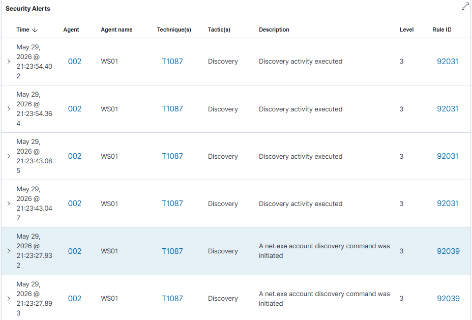
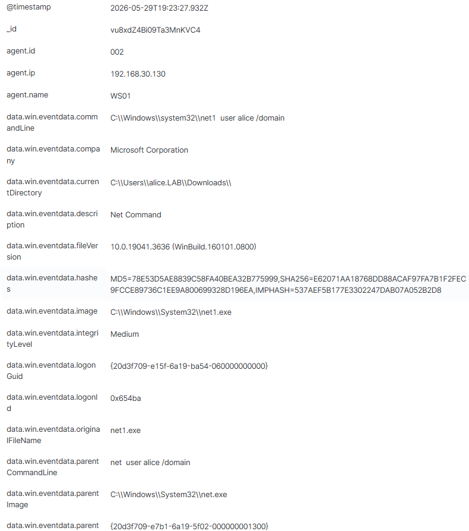

## Détection
### Recherche dans Wazuh

Filtre
```wazuh
agent.name: WS01 
```

### Règles déclenchées nativement

Wazuh détecte les commandes de reconnaissance sans règle custom.

| Rule ID | Level | Technique | Description |
|---------|-------|-----------|-------------|
| 92039 | 3 | T1087 | A net.exe account discovery command was initiated |
| 92031 | 3 | T1087 | Discovery activity executed |

### Champs clés (Sysmon Event ID 1)

| Champ | Valeur |
|-------|--------|
| commandLine | `net1 user alice /domain` |
| parentCommandLine | `net user alice /domain` |
| currentDirectory | `C:\Users\alice.LAB\Downloads\` |
| integrityLevel | Medium |
| image | `C:\Windows\System32\net1.exe` |

### Alertes Wazuh





### Analyse

Les commandes `net user`, `net group` et `net localgroup` sont des 
commandes Windows légitimes. Leur exécution depuis `C:\Users\alice.LAB\Downloads\` 
et en rafale sur une courte période est un signal d'énumération AD.

Wazuh identifie ce comportement nativement via la règle 92039, 
pas besoin de règle custom pour ce scénario.
