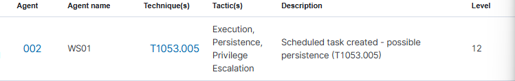

## Détection

### Pipeline de détection

| Composant | Rôle |
|-----------|------|
| Windows Security Log | Génère Event ID 4698 à chaque création de tâche planifiée |
| Wazuh agent | Ingestion du canal Security |
| Règle custom Wazuh | Aucune règle native pour T1053.005, règle custom nécessaire |

> L'Event ID 4698 nécessite l'activation de l'audit "Other Object Access Events"
> via GPO (Success and Failure). Non activé par défaut.

### Activation de l'audit (GPO)

Computer Configuration → Windows Settings → Security Settings → Advanced Audit Policy Configuration → Object Access → Audit Other Object Access Events → Success and Failure

### Règle custom 100008

```xml
<rule id="100008" level="12">
  <if_sid>60103</if_sid>
  <field name="win.system.eventID">4698</field>
  <description>Scheduled task created - possible persistence (T1053.005)</description>
  <mitre>
    <id>T1053.005</id>
  </mitre>
</rule>
```

| Champ | Signification |
|-------|--------------|
| `if_sid 60103` | Règle parent Wazuh pour les events Windows Security |
| `eventID 4698` | A scheduled task was created |
| `level 12` | Criticité haute |

> Pyramid of Pain : niveau **TTP** - la création d'une tâche planifiée est
> détectée quel que soit le nom ou le payload utilisé.

### Champs clés (Event ID 4698)

| Champ | Valeur |
|-------|--------|
| subjectUserName | alice |
| taskName | \OneDriveUpdate |
| Command | C:\Users\alice.LAB\AppData\Local\Microsoft\OneDrive\OneDriveUpdater.exe |

### Alertes Wazuh



