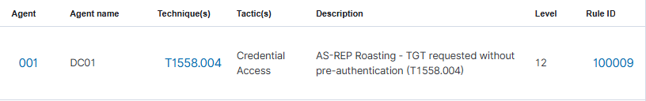

## Détection

### Pipeline de détection

| Composant | Rôle |
|-----------|------|
| Windows Security Log (DC01) | Génère Event ID 4768 à chaque demande de TGT Kerberos |
| Wazuh agent | Ingestion du canal Security de DC01 |
| Règle custom Wazuh | Aucune règle native pour T1558.004, règle custom nécessaire |

> L'Event ID 4768 nécessite l'activation de l'audit Kerberos via GPO.
> Non activé par défaut.

### Activation de l'audit (GPO)

Computer Configuration → Windows Settings → Security Settings → Advanced Audit Policy Configuration → Account Logon → Audit Kerberos Authentication Service → Success and Failure

### Règle custom 100009

```xml
<rule id="100009" level="12">
  <if_sid>60103</if_sid>
  <field name="win.system.eventID">4768</field>
  <field name="win.eventdata.preAuthType">0</field>
  <description>AS-REP Roasting - TGT requested without pre-authentication (T1558.004)</description>
  <mitre>
    <id>T1558.004</id>
  </mitre>
</rule>
```

| Champ           | Signification                                        |
| --------------- | ---------------------------------------------------- |
| `if_sid 60103`  | Règle parent Wazuh pour les events Windows Security  |
| `eventID 4768`  | A Kerberos authentication ticket (TGT) was requested |
| `level 12`      | Criticité haute                                      |
| `preAuthType 0` | Pas de pré-authentification, signal AS-REP Roasting  |
### Champs clés (Event ID 4768)

| Champ | Valeur |
|-------|--------|
| targetUserName | svc-backup |
| preAuthType | 0 (pas de pré-authentification) |
| ipAddress | ::ffff:192.168.10.200 (Kali) |
| ticketEncryptionType | 0x17 (RC4, crackable offline) |

### Alertes Wazuh



