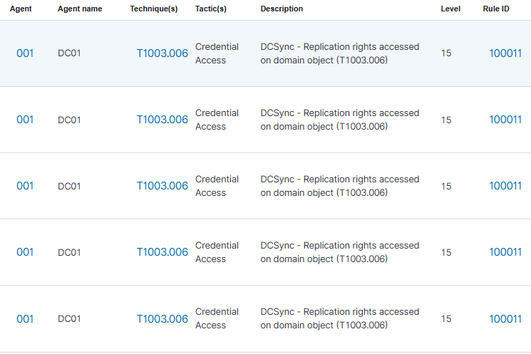

## Détection

### Pipeline de détection

| Composant | Rôle |
|-----------|------|
| Windows Security Log (DC01) | Génère Event ID 4662 à chaque accès aux objets AD |
| Wazuh agent | Ingestion du canal Security de DC01 |
| Règle custom Wazuh | Aucune règle native pour T1003.006, règle custom nécessaire |

> L'Event ID 4662 nécessite l'activation de l'audit "Directory Service Access" via GPO.
> Non activé par défaut.

### Activation de l'audit (GPO)

Computer Configuration → Windows Settings → Security Settings → Advanced Audit Policy Configuration → DS Access → Audit Directory Service Access → Success and Failure

### Règle custom 100011

```xml
<rule id="100011" level="15">
  <if_sid>60103</if_sid>
  <field name="win.system.eventID">4662</field>
  <field name="win.eventdata.properties" type="pcre2">1131f6aa|1131f6ad</field>
  <description>DCSync - Replication rights accessed on domain object (T1003.006)</description>
  <mitre>
    <id>T1003.006</id>
  </mitre>
</rule>
```

| Champ | Signification |
|-------|--------------|
| `if_sid 60103` | Règle parent Wazuh pour les events Windows Security |
| `eventID 4662` | Accès à un objet AD |
| `1131f6aa\|1131f6ad` | GUIDs des droits DS-Replication-Get-Changes et DS-Replication-Get-Changes-All |
| `level 15` | Criticité maximale |

> Un DCSync génère une rafale d'events 4662, un par objet répliqué.
> La rafale soudaine est en elle-même le signal caractéristique.

### Alertes Wazuh


