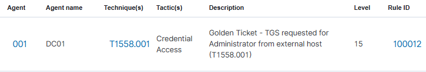

## Détection

### Pipeline de détection

| Composant | Rôle |
|-----------|------|
| Windows Security Log (DC01) | Génère Event ID 4769 lors de l'utilisation du ticket |
| Wazuh agent | Ingestion du canal Security de DC01 |
| Règle custom Wazuh | Détection partielle via 4769 pour Administrator |

> L'Event ID 4769 nécessite l'activation de l'audit Kerberos via GPO.
> Déjà configuré dans `DOMAIN-AUDIT-KERBEROS`.

### Règle custom 100012

```xml
<rule id="100012" level="15">
  <if_sid>60103</if_sid>
  <field name="win.system.eventID">4769</field>
  <field name="win.eventdata.targetUserName" type="pcre2">(?i)^administrator@</field>
  <field name="win.eventdata.ipAddress" type="pcre2">(?!::1$)</field>
  <description>Golden Ticket - TGS requested for Administrator from external host (T1558.001)</description>
  <mitre>
    <id>T1558.001</id>
  </mitre>
</rule>
```

| Champ | Signification |
|-------|--------------|
| `eventID 4769` | Demande de TGS Kerberos |
| `targetUserName ^administrator@` | Compte Administrator ciblé |
| `ipAddress (?!::1$)` | Exclut localhost, capture les connexions externes |
| `level 15` | Criticité maximale |

> **Limite** : en production cette règle générerait des faux positifs si Administrator
> se connecte légitimement à des services depuis un poste externe.
> Dans ce lab elle est pertinente car Administrator ne devrait jamais
> générer de TGS depuis Kali (192.168.10.200).

### Pourquoi le Golden Ticket est difficile à détecter ?

Le ticket est forgé offline. Il ne génère pas d'Event ID 4768 (TGT).
Seul le 4769 apparaît lors de son utilisation.

Les signaux complémentaires non couverts par ce lab :
- Corrélation 4769 sans 4768 préalable
- Ticket avec durée de validité anormale (10 ans avec impacket)

Ces signaux nécessitent une inspection du trafic réseau Kerberos (Zeek, Snort).

### Alertes Wazuh


