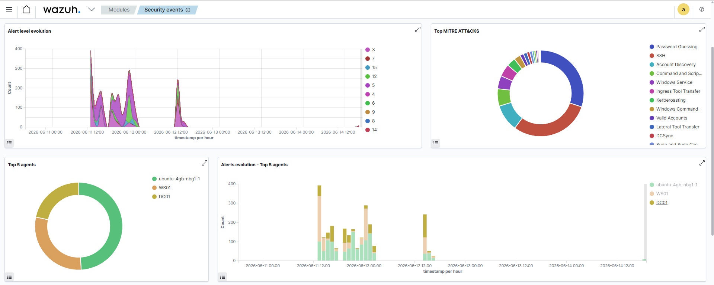

# Lab Purple Team - Active Directory



Lab de cybersécurité offensif et défensif construit pour pratiquer et documenter
des techniques d'attaque sur un environnement Active Directory, avec détection
via Wazuh.

---

## Infrastructure


| Machine | Rôle                   | IP              | OS                  |
| ------- | ---------------------- | --------------- | ------------------- |
| DC01    | Active Directory / DNS | 192.168.10.100  | Windows Server 2022 |
| WS01    | Client domaine         | 192.168.10.101  | Windows 10 Pro      |
| Kali    | Attaquant              | 192.168.10.200  | Kali Linux 2026.2   |
| Wazuh   | SIEM                   | IP publique VPS | Ubuntu 22.04        |

Réseau : Host-Only VMware `192.168.10.0/24` - Domaine : `lab.local`

---

## Catalogue des attaques

| #   | Scénario             | Technique MITRE     | Tactique             |
| --- | -------------------- | ------------------- | -------------------- |
| 01  | Reverse Shell        | T1204.002           | Execution            |
| 02  | Local Recon          | T1082, T1016, T1069 | Discovery            |
| 03  | Privilege Escalation | T1548.002           | Privilege Escalation |
| 04  | Credential Dump      | T1003.001           | Credential Access    |
| 05  | Persistence          | T1053.005           | Persistence          |
| 06  | AS-REP Roasting      | T1558.004           | Credential Access    |
| 07  | Kerberoasting        | T1558.003           | Credential Access    |
| 08  | DCSync               | T1003.006           | Credential Access    |
| 09  | Golden Ticket        | T1558.001           | Persistence          |

Chaque scénario est documenté en trois parties : `attack.md` / `detection.md` / `patch.md`

---

## Stack technique

| Outil | Rôle |
|-------|------|
| Metasploit | Exploitation et post-exploitation |
| Mimikatz (kiwi) | Credential dumping |
| Impacket | Attaques AD (AS-REP, Kerberoasting, DCSync, Golden Ticket) |
| BloodHound CE | Cartographie AD et chemins d'attaque |
| SharpHound | Collecte des données AD |
| Wazuh | SIEM - détection et alerting |
| Sysmon (SwiftOnSecurity) | Télémétrie endpoint |

---

## Concessions du lab

| Concession                                 | Condition réelle                                                                                                                                                                                     |
| ------------------------------------------ | ---------------------------------------------------------------------------------------------------------------------------------------------------------------------------------------------------- |
| Kali sur le même réseau que l'AD           | Attaquant externe, outils impacket via tunnel SOCKS ou Rubeus depuis la machine compromise                                                                                                           |
| Defender actif avec exclusions de dossiers | Defender résiste à la désactivation via GPO (Tamper Protection). Les dossiers Downloads et OneDrive sont exclus de l'analyse. En conditions réelles le payload nécessiterait une évasion AV (T1027). |

---

## Limites & axes d'amélioration

Ce lab valide la détection de chaque technique de façon qualitative (alerte déclenchée ou non), 
mais ne mesure pas certains indicateurs qu'un SOC en production suivrait :

| KPI non mesuré          | Pourquoi c'est important                                          |
|--------------------------|---------------------------------------------------------------------|
| Taux de faux positifs    | Une règle qui détecte mais génère trop de bruit n'est pas exploitable en prod |
| MTTD (Mean Time To Detect) | Délai entre l'exécution de la technique et le déclenchement de l'alerte |
| Couverture de log        | Toutes les sources pertinentes (ex: logs réseau, EDR) ne sont pas centralisées dans ce lab |
| Volume / bruit en conditions réelles | Le lab génère peu de trafic légitime, donc les règles n'ont pas été testées contre du bruit de fond |

Prochaine itération prévue : rejouer les 9 scénarios avec Atomic Red Team pour mesurer 
le taux de détection et de faux positifs de façon quantitative, plutôt que qualitative.

---

## Structure du projet

```
00_INFRA/         Infrastructure et réseau
01_ACTIVE_DIRECTORY/  Utilisateurs, OUs, GPO
02_SIEM/          Configuration Wazuh, règles custom
03_ENDPOINTS/     Configuration Sysmon
04_ATTACKS/       Scénarios d'attaque
```
